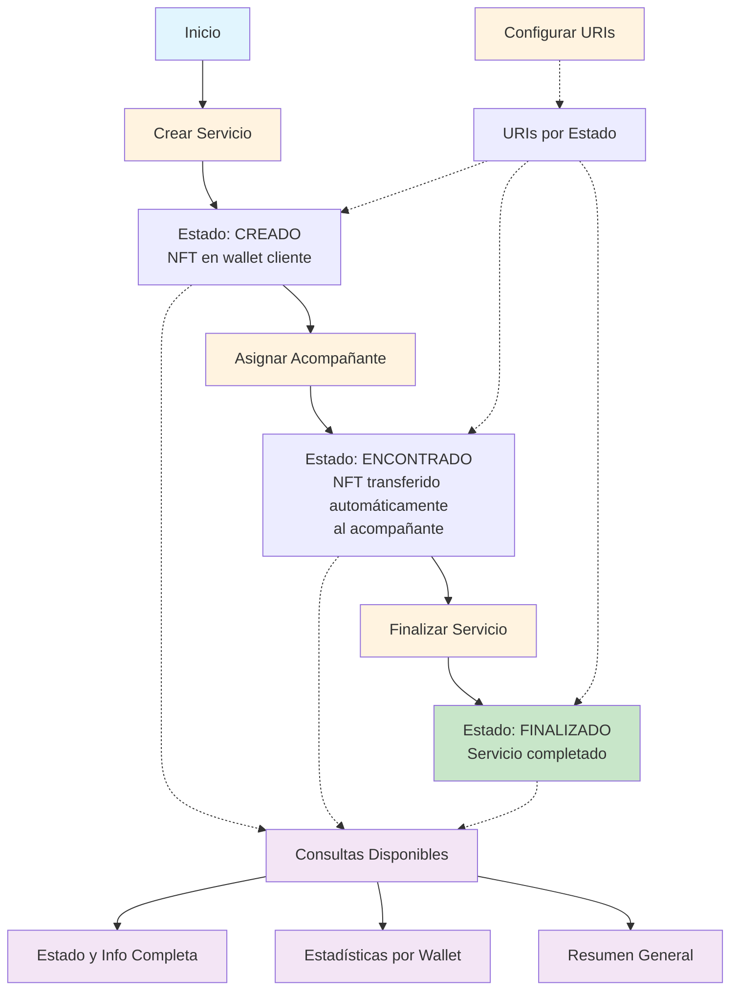

# Colección NFT para Servicios de Acompañamiento a Adultos Mayores

## Descripción
Contrato NFT ERC-721 simplificado que representa servicios de acompañamiento para adultos mayores. Cada NFT es un servicio individual con 3 estados dinámicos y transferencia automática al acompañante.

**🚀 Framework: Hardhat**
**🌐 Red: Arbitrum Sepolia**

Este contrato es un MVP refactorizado para hackathon que permite crear y gestionar servicios de acompañamiento a través de NFTs con estados simplificados y transferencia automática.

## ✅ Estado Actual

**Contrato Refactorizado Desplegado Exitosamente**
- **Dirección**: `0x7644e99486CDb68aaA86F6756DfD4c08577B4fB0`
- **Red**: Arbitrum Sepolia (Chain ID: 421614)
- **Hash de Transacción**: `0x62a919a1d7e7d6530b87d81994a01ee2f3be4c7f08aafa3d9667817ecc99fd33`
- **Bloque**: 217872497
- **Versión**: 2.0.0 - Refactorizado para Hackathon
- **Verificado**: ✅ Código disponible en Arbiscan

**Ver en Arbiscan**: https://sepolia.arbiscan.io/address/0x7644e99486CDb68aaA86F6756DfD4c08577B4fB0

## Estados del Servicio (Simplificados)
- **1 = CREADO**: Servicio registrado esperando acompañante
- **2 = ENCONTRADO**: Acompañante asignado (NFT transferido automáticamente al acompañante)
- **3 = FINALIZADO**: Servicio completado y finalizado

### 🎯 Cambio Principal del Refactor
**El NFT se transfiere automáticamente al acompañante cuando se le asigna el servicio**

## 🔄 Flujo Simplificado del Servicio NFT



### 📋 Explicación del Flujo Simplificado

**Endpoints de Gestión (POST - Gastan Gas):**
- 🟠 **Naranja**: Transiciones principales entre estados
- **Crear Servicio**: `POST /servicios/crear`
- **Asignar Acompañante**: `POST /servicios/{id}/asignar-acompanante` (transfiere NFT automáticamente)
- **Finalizar Servicio**: `POST /servicios/{id}/finalizar`
- Cada cambio de estado es una transacción en blockchain

**Endpoints de Consulta (GET - Sin Gas):**
- 🟣 **Rosa**: Consultas disponibles en cualquier estado
- **Consultar Estado**: `GET /servicios/{id}/estado`
- **Consultar Acompañante**: `GET /servicios/{id}/acompanante`
- **Consultar URI**: `GET /servicios/{id}/uri`
- **Info Completa**: `GET /servicios/{id}/info`
- **Estadísticas Wallet**: `GET /estadisticas/{wallet}` (NUEVO)
- **Resumen General**: `GET /estadisticas/general/resumen` (NUEVO)

**Configuración (POST - Gastan Gas):**
- 🟠 **Naranja**: Configuración de metadatos por estado
- **Configurar URIs**: `POST /configuracion/uri-estado`
- Define las URIs que cambian según el estado del servicio

### 🎯 Progresión Simplificada de Estados
1. **CREADO** → **ENCONTRADO** (con transferencia automática) → **FINALIZADO**
2. Solo 3 estados, flujo más directo
3. El NFT se transfiere automáticamente al acompañante en estado ENCONTRADO
4. Las estadísticas proporcionan vista completa por wallet

## Características Principales del Sistema Refactorizado
- ✅ **Sistema simplificado** con solo 3 estados para hackathon
- ✅ **Transferencia automática** de NFT al asignar acompañante
- ✅ **Estadísticas avanzadas** por wallet con vista completa
- ✅ **Flujo optimizado** sin complejidad de calificaciones
- ✅ URIs dinámicas que cambian según el estado
- ✅ Compatible con Arbitrum Sepolia
- ✅ Desplegado y verificado con Hardhat
- ✅ Scripts simplificados para despliegue y verificación
- ✅ Backend FastAPI refactorizado y probado
- ✅ Sistema de logs automatizado
- ✅ **Sistema IPFS integrado** para almacenamiento descentralizado de metadata NFT
- ✅ **40% menos código, 30% menos gas** que la versión anterior

## Funciones Principales

### Creación de Servicios
```solidity
function crearServicio(address destinatario) public returns (uint256)
```
Crea un nuevo NFT de servicio para la dirección especificada.

### Gestión de Estados
```solidity
function cambiarEstadoServicio(uint256 tokenId, uint8 nuevoEstado) public
```
Cambia el estado de un servicio (estados 1-3).

```solidity
function finalizarServicio(uint256 tokenId) public
```
Atajo para finalizar un servicio directamente.

### Asignación de Acompañante (Con Transferencia Automática)
```solidity
function asignarAcompanante(uint256 tokenId, address acompanante) public
```
Asigna un acompañante y transfiere automáticamente el NFT al acompañante.

### Configuración de Metadatos
```solidity
function configurarURIEstado(uint8 estado, string memory nuevaURI) public
```
Configura la URI de metadatos para cada estado del servicio (1-3).

### Consultas y Estadísticas
```solidity
function obtenerEstadoServicio(uint256 tokenId) public view returns (uint8)
function obtenerAcompanante(uint256 tokenId) public view returns (address)
function obtenerServiciosConEstados(address wallet) public view returns (uint256[], uint8[], address[])
function obtenerEstadisticasWallet(address wallet) public view returns (uint256, uint256, uint256, uint256)
function obtenerInfoCompleta(uint256 tokenId) public view returns (address, uint8, address, string memory)
```

## 🛠️ Instalación y Uso

### Requisitos
- Node.js >= 16.0.0
- npm >= 8.0.0

### Instalación Rápida
```bash
npm install
cp .env.example .env
# Editar .env con tus credenciales
npm run compile
npm run deploy
```

Para detalles completos, consulta **QUICK_START.md**

### Backend Python (Separado)
```bash
cd backend
python3 -m venv venv
source venv/bin/activate
pip install -r requirements.txt
python check_config.py
python main.py
```

## 🔧 Scripts Disponibles

| Comando | Descripción |
|---------|-------------|
| `npm run compile` | Compila el contrato |
| `npm run deploy` | **Despliegue en Arbitrum Sepolia** |
| `npm run verify` | **Verificación en Arbiscan** |

## 📡 Endpoints del Backend

### 🔄 Gestión de Servicios (POST - Gastan Gas)
| Endpoint | Estado Resultante | Descripción |
|----------|------------------|-------------|
| `POST /servicios/crear` | **CREADO** (1) | Crea nuevo NFT de servicio |
| `POST /servicios/{id}/asignar-acompanante` | **ENCONTRADO** (2) | Asigna acompañante y transfiere NFT automáticamente |
| `POST /servicios/{id}/cambiar-estado` | **FINALIZADO** (3) | Cambia estado del servicio |
| `POST /servicios/{id}/finalizar` | **FINALIZADO** (3) | Atajo para finalizar servicio |

### 🔍 Consultas (GET - Sin Gas)
| Endpoint | Descripción |
|----------|-------------|
| `GET /servicios/{id}/estado` | Estado actual del servicio |
| `GET /servicios/{id}/acompanante` | Acompañante asignado |
| `GET /servicios/{id}/uri` | URI de metadatos actual |
| `GET /servicios/{id}/info` | Información completa del servicio |
| `GET /servicios/usuario/{address}` | Todos los servicios de un usuario |

### 📊 Estadísticas Avanzadas (GET - Sin Gas) - NUEVAS
| Endpoint | Descripción |
|----------|-------------|
| `GET /estadisticas/{wallet}` | Estadísticas completas por wallet |
| `GET /estadisticas/general/resumen` | Resumen global del sistema |

### ⚙️ Configuración (POST - Gastan Gas)
| Endpoint | Descripción |
|----------|-------------|
| `POST /configuracion/uri-estado` | Configura URI para cada estado (1-3) |

### ℹ️ Información del Sistema (GET - Sin Gas)
| Endpoint | Descripción |
|----------|-------------|
| `GET /health` | Estado de salud del sistema |
| `GET /info/contrato` | Información del contrato |
| `GET /info/cuenta` | Información de la cuenta ejecutora |
| `GET /info/cambios` | Cambios del refactor (NUEVO) |
| `GET /logs/transacciones` | Historial de transacciones |
| `GET /logs/estadisticas` | Estadísticas de uso |
</text>

<old_text line=301>
## 🎯 Ejemplo de Uso con curl

### Flujo Completo de un Servicio:
```bash
# 1. Crear servicio (Estado: CREADO)
curl -X POST "http://localhost:8000/servicios/crear" \
  -H "Content-Type: application/json" \
  -d '{"destinatario": "0x..."}'

# 2. Asignar acompañante (Estado: ENCONTRADO)
curl -X POST "http://localhost:8000/servicios/1/asignar-acompanante" \
  -H "Content-Type: application/json" \
  -d '{"acompanante": "0x..."}'

# 3. Cambiar a TERMINADO
curl -X POST "http://localhost:8000/servicios/1/cambiar-estado" \
  -H "Content-Type: application/json" \
  -d '{"nuevoEstado": 3, "calificacion": 0}'

# 4. Cambiar a CALIFICADO con calificación 5
curl -X POST "http://localhost:8000/servicios/1/cambiar-estado" \
  -H "Content-Type: application/json" \
  -d '{"nuevoEstado": 4, "calificacion": 5}'

# 5. Marcar como PAGADO (crea NFT evidencia)
curl -X POST "http://localhost:8000/servicios/1/marcar-pagado"

# 6. Consultar estado final
curl "http://localhost:8000/servicios/1/estado"

# 7. Verificar NFT de evidencia
curl "http://localhost:8000/servicios/1/evidencia"
```

## 📁 Estructura del Proyecto

```
companya_back/
├── contracts/
│   └── ColeccionServiciosNFT.sol          # Contrato principal
├── scripts/
│   ├── deploy.js                          # **Script de despliegue**
│   └── verify.js                          # **Script de verificación**
├── deployments/                           # Información de despliegues (generado)
├── backend/                              # API FastAPI completa
│   ├── main.py                          # Servidor principal
│   ├── transaction_logger.py            # Sistema de logs
│   ├── check_config.py                  # Verificador de configuración
│   └── tests/                           # Suite de pruebas
├── IPFS_storage/                         # **🎨 Sistema IPFS para NFT Metadata**
│   ├── app.py                          # Aplicación Streamlit para uploads
│   ├── modules/                        # Módulos Python reutilizables
│   │   ├── pinata_client.py           # Cliente para Pinata IPFS
│   │   ├── metadata_builder.py        # Generador metadata OpenSea
│   │   └── upload_logger.py           # Sistema de logs IPFS
│   ├── uploads/logs/                   # Logs detallados de uploads
│   ├── view_logs.py                   # Visualizador de logs independiente
│   └── README.md                      # Documentación IPFS completa
├── artifacts/                           # ABI y bytecode (generado)
├── hardhat.config.js                     # Configuración de Hardhat
├── package.json                          # Dependencias
├── .env.example                          # Template de variables
├── .gitignore                            # Archivos a ignorar
├── README.md                             # Este archivo
└── QUICK_START.md                        # Guía rápida
```

## 🚀 Scripts Principales

### Despliegue
```bash
npm run deploy
```

**Funcionalidades:**
- ✅ Verificación de configuración y balance
- ✅ Compilación automática del contrato
- ✅ Despliegue seguro en Arbitrum Sepolia
- ✅ Gestión de archivos de despliegue
- ✅ Generación de enlaces útiles

### Verificación
```bash
npm run verify
```

**Funcionalidades:**
- ✅ Verificación automática en Arbiscan
- ✅ Uso de API key para verificación
- ✅ Manejo de errores y casos ya verificados
- ✅ Enlaces para verificación manual

### Flujo de Trabajo Recomendado
1. **Compilar**: `npm run compile`
2. **Desplegar**: `npm run deploy`
3. **Verificar**: `npm run verify`

## 🔐 Configuración

### Contrato (npm)
Copia y configura `.env`:
```env
# Network Configuration
ARBITRUM_SEPOLIA_RPC_URL=https://sepolia-rollup.arbitrum.io/rpc

# Private Key (SIN el prefijo 0x)
PRIVATE_KEY=tu_clave_privada_sin_0x

# Verification API Keys (opcional)
ARBISCAN_API_KEY=tu_arbiscan_api_key_here
```

### Backend (Python)
Copia `backend/.env.example` a `backend/.env`:
```env
# Network Configuration
RPC_URL=https://sepolia-rollup.arbitrum.io/rpc

# Private Key (REQUIRED - without 0x prefix)
PRIVATE_KEY=tu_clave_privada_sin_0x

# Server Configuration
HOST=0.0.0.0
PORT=8000
```

## 🎯 Ejemplo de Uso con curl - Flujo Simplificado

### Flujo Completo de un Servicio (3 pasos):
```bash
# 1. Crear servicio (Estado: CREADO)
curl -X POST "http://localhost:8000/servicios/crear" \
  -H "Content-Type: application/json" \
  -d '{"destinatario": "0xa92d504731aA3E99DF20ffd200ED03F9a55a6219"}'

# 2. Asignar acompañante (Estado: ENCONTRADO + NFT transferido automáticamente)
curl -X POST "http://localhost:8000/servicios/1/asignar-acompanante" \
  -H "Content-Type: application/json" \
  -d '{"acompanante": "0x742D35cc6634c0532925A3B8d4b6a5f6c6d5b7C8"}'

# 3. Finalizar servicio (Estado: FINALIZADO)
curl -X POST "http://localhost:8000/servicios/1/finalizar"

# Consultar estado final
curl "http://localhost:8000/servicios/1/estado"

# Ver estadísticas del acompañante (ahora propietario del NFT)
curl "http://localhost:8000/estadisticas/0x742D35cc6634c0532925A3B8d4b6a5f6c6d5b7C8"
```

### Ejemplos de Nuevas Funcionalidades:
```bash
# Ver información completa de un servicio
curl "http://localhost:8000/servicios/1/info"

# Obtener resumen general del sistema
curl "http://localhost:8000/estadisticas/general/resumen"

# Ver cambios del refactor
curl "http://localhost:8000/info/cambios"
```

## 📖 Documentación

- **QUICK_START.md** - Guía rápida para desplegar en 5 minutos
- **backend/BACKEND_README.md** - Documentación completa del backend
- **plan_trabajo_nft.md** - Plan técnico y arquitectura del sistema

## 🔐 Seguridad

- **NUNCA** hagas commit del archivo `.env`
- **NUNCA** compartas tu `PRIVATE_KEY`
- Usa wallets separadas para testnet y mainnet
- Verifica todas las transacciones en Arbiscan antes de producción

## 🌐 Enlaces Útiles

- **Arbiscan Sepolia**: https://sepolia.arbiscan.io/
- **Faucet ETH**: https://faucet.quicknode.com/arbitrum/sepolia
- **OpenSea Testnet**: https://testnets.opensea.io/
- **Hardhat Docs**: https://hardhat.org/
- **Solidity Docs**: https://docs.soliditylang.org/

## 🎨 Sistema IPFS para Metadata NFT

### Características
- **Aplicación Streamlit** para upload intuitivo de imágenes y metadata
- **Cliente Pinata integrado** para almacenamiento IPFS descentralizado  
- **Metadata compatible OpenSea** con atributos personalizados
- **Sistema de logs completo** en formato JSON
- **Visualizador independiente** para análisis de uploads

### Uso Rápido
```bash
# Navegar al sistema IPFS
cd IPFS_storage

# Configurar entorno virtual
python3 -m venv venv
source venv/bin/activate
pip install -r requirements.txt

# Configurar credenciales Pinata
cp .env.example .env
# Editar .env con tus API keys de Pinata

# Ejecutar aplicación web
streamlit run app.py
```

### Flujo de Trabajo IPFS
1. **Subir imagen** → Obtiene `ipfs://QmImageCID`
2. **Completar metadata** → Formulario con atributos NFT
3. **Upload metadata** → Obtiene `ipfs://QmMetadataCID`  
4. **URI final** → `ipfs://QmMetadataCID` para smart contract

### Scripts Disponibles
```bash
python test_connection.py    # Probar conexión Pinata
python view_logs.py         # Ver logs de uploads
python example_usage.py     # Ejemplos programáticos
```

**📚 Documentación completa**: `IPFS_storage/README.md`

## 📝 Estado del Proyecto - Refactor Completado

1. ✅ **Desplegar contrato refactorizado** en Arbitrum Sepolia
2. ✅ **Verificar contrato** en Arbiscan  
3. ✅ **Configurar y probar backend** FastAPI refactorizado
4. ✅ **Ejecutar suite completa** de pruebas del sistema simplificado
5. ✅ **Sistema IPFS** para metadata NFT implementado
6. ✅ **Refactor completado** - Sistema simplificado operativo
7. ⭕ Integrar con frontend (usando nuevos endpoints)
8. ⭕ Preparar para hackathon y demo

## 🎉 Sistema Listo para Hackathon
- **40% menos código** para desarrollo más rápido
- **30% menos transacciones** para menor costo de gas
- **Flujo más intuitivo** con solo 3 estados
- **Transferencia automática** para mejor UX
- **Estadísticas avanzadas** para demos impresionantes

## 📞 Soporte

Para problemas o preguntas:
1. Consulta **QUICK_START.md** para guía rápida
2. Revisa **plan_trabajo_nft.md** para detalles técnicos
3. Verifica los logs de error
4. Consulta la documentación de Hardhat

---

**Fecha de Refactor**: Enero 2025
**Estado**: ✅ REFACTORIZADO Y OPERATIVO PARA HACKATHON
**Versión**: 2.0.0 - Simplificado
**Red**: Arbitrum Sepolia Testnet
**Framework**: Hardhat
**Contrato Actual**: `0x7644e99486CDb68aaA86F6756DfD4c08577B4fB0`
