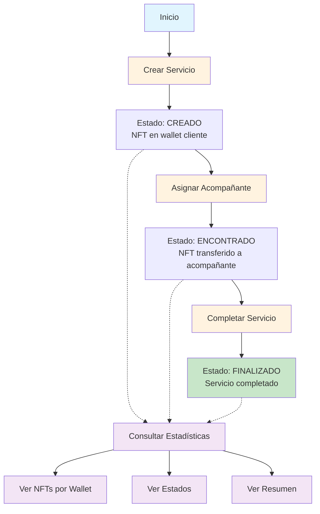

# 📋 Plan de Refactor - Simplificación Sistema NFT Companya
## Hackathon MVP - Simplificación de Estados y Flujo

---

## 🎯 Objetivo del Refactor
Simplificar el sistema de NFT para servicios de acompañamiento a adultos mayores, reduciendo la complejidad para un MVP de hackathon mientras se mantiene la funcionalidad esencial.

### Cambios Principales
1. **Reducción de estados**: De 5 estados a 3 estados
2. **Eliminación del sistema de calificación**: Simplificar el flujo
3. **Transferencia automática de NFT**: Al asignar acompañante (estado ENCONTRADO)
4. **Nuevo endpoint de estadísticas**: Consulta completa por wallet
5. **Simplificación general del código**: Menos complejidad, más claridad

---

## 📊 Comparación de Estados

### Sistema Actual (5 Estados)
```
1. CREADO → 2. ENCONTRADO → 3. TERMINADO → 4. CALIFICADO → 5. PAGADO
```
- Sistema de calificación (1-5)
- NFT de evidencia al pagar
- Múltiples transiciones de estado

### Sistema Nuevo (3 Estados)
```
1. CREADO → 2. ENCONTRADO → 3. FINALIZADO
```
- Sin sistema de calificación
- Transferencia de NFT en estado ENCONTRADO
- Flujo simplificado y directo

---

## 🔧 1. CAMBIOS EN EL CONTRATO INTELIGENTE

### Archivo: `contracts/ColeccionServiciosNFT.sol`

#### 1.1 Eliminaciones
- ❌ Mapping `calificacionesServicios`
- ❌ Mapping `evidenciasServicios` 
- ❌ Función `obtenerCalificacionServicio()`
- ❌ Función `obtenerEvidenciaServicio()`
- ❌ Función `marcarComoPagado()`
- ❌ Lógica de calificación en `cambiarEstadoServicio()`
- ❌ Lógica de creación de NFT de evidencia
- ❌ Eventos relacionados con calificación y pago

#### 1.2 Modificaciones

##### Estados y Constantes
```solidity
// Estados simplificados: 1=CREADO, 2=ENCONTRADO, 3=FINALIZADO
uint8 public constant ESTADO_CREADO = 1;
uint8 public constant ESTADO_ENCONTRADO = 2;
uint8 public constant ESTADO_FINALIZADO = 3;
```

##### Función cambiarEstadoServicio()
```solidity
function cambiarEstadoServicio(uint256 tokenId, uint8 nuevoEstado) public {
    require(_ownerOf(tokenId) != address(0), "Servicio no existe");
    require(nuevoEstado >= 1 && nuevoEstado <= 3, "Estado invalido");
    
    uint8 estadoAnterior = estadosServicios[tokenId];
    
    // Validar transiciones permitidas
    if (nuevoEstado == 2) { // ENCONTRADO
        require(estadoAnterior == 1, "Servicio debe estar en CREADO");
        require(acompanantesServicios[tokenId] != address(0), "Acompanante no asignado");
    } else if (nuevoEstado == 3) { // FINALIZADO
        require(estadoAnterior == 2, "Servicio debe estar en ENCONTRADO");
    }
    
    estadosServicios[tokenId] = nuevoEstado;
    
    // Actualizar URI según el nuevo estado
    if (bytes(URIsPorEstado[nuevoEstado]).length > 0) {
        _setTokenURI(tokenId, URIsPorEstado[nuevoEstado]);
    }
    
    emit EstadoCambiado(tokenId, estadoAnterior, nuevoEstado);
}
```

##### Función asignarAcompanante() - MODIFICADA
```solidity
function asignarAcompanante(uint256 tokenId, address acompanante) public {
    require(_ownerOf(tokenId) != address(0), "Servicio no existe");
    require(acompanante != address(0), "Acompanante no valido");
    require(estadosServicios[tokenId] == 1, "Servicio debe estar en CREADO");
    
    // Asignar acompañante
    acompanantesServicios[tokenId] = acompanante;
    
    // Cambiar automáticamente a estado ENCONTRADO
    uint8 estadoAnterior = estadosServicios[tokenId];
    estadosServicios[tokenId] = 2; // ENCONTRADO
    
    // NUEVA FUNCIONALIDAD: Transferir NFT al acompañante
    address propietarioActual = ownerOf(tokenId);
    _transfer(propietarioActual, acompanante, tokenId);
    
    // Actualizar URI
    if (bytes(URIsPorEstado[2]).length > 0) {
        _setTokenURI(tokenId, URIsPorEstado[2]);
    }
    
    emit EstadoCambiado(tokenId, estadoAnterior, 2);
    emit AcompananteAsignado(tokenId, acompanante);
}
```

##### Nuevas Funciones de Consulta
```solidity
// Obtener todos los servicios de una wallet con sus estados
function obtenerServiciosConEstados(address wallet) public view returns (
    uint256[] memory tokenIds,
    uint8[] memory estados,
    address[] memory acompanantes
) {
    uint256 balance = balanceOf(wallet);
    tokenIds = new uint256[](balance);
    estados = new uint8[](balance);
    acompanantes = new address[](balance);
    
    uint256 index = 0;
    for (uint256 i = 0; i < _nextTokenId && index < balance; i++) {
        if (_ownerOf(i) == wallet) {
            tokenIds[index] = i;
            estados[index] = estadosServicios[i];
            acompanantes[index] = acompanantesServicios[i];
            index++;
        }
    }
    
    return (tokenIds, estados, acompanantes);
}

// Obtener estadísticas generales de una wallet
function obtenerEstadisticasWallet(address wallet) public view returns (
    uint256 totalServicios,
    uint256 serviciosCreados,
    uint256 serviciosEncontrados,
    uint256 serviciosFinalizados
) {
    totalServicios = balanceOf(wallet);
    
    for (uint256 i = 0; i < _nextTokenId; i++) {
        if (_ownerOf(i) == wallet) {
            uint8 estado = estadosServicios[i];
            if (estado == 1) serviciosCreados++;
            else if (estado == 2) serviciosEncontrados++;
            else if (estado == 3) serviciosFinalizados++;
        }
    }
    
    return (totalServicios, serviciosCreados, serviciosEncontrados, serviciosFinalizados);
}
```

#### 1.3 Eventos Actualizados
```solidity
event ServicioCreado(uint256 indexed tokenId, address indexed destinatario);
event EstadoCambiado(
    uint256 indexed tokenId,
    uint8 estadoAnterior,
    uint8 nuevoEstado
);
event AcompananteAsignado(
    uint256 indexed tokenId,
    address indexed acompanante
);
event URIEstadoConfigurada(uint8 estado, string nuevaURI);
```

---

## 💻 2. CAMBIOS EN EL BACKEND (FastAPI)

### Archivo: `backend/main.py`

#### 2.1 Eliminaciones de Endpoints
- ❌ `POST /servicios/{id}/marcar-pagado`
- ❌ `GET /servicios/{id}/calificacion`
- ❌ `GET /servicios/{id}/evidencia`

#### 2.2 Modificaciones de Endpoints

##### POST /servicios/{id}/cambiar-estado
```python
@app.post("/servicios/{tokenId}/cambiar-estado")
async def cambiar_estado_servicio(tokenId: int, nuevoEstado: int):
    """
    Cambiar Estado del Servicio
    
    Estados válidos:
    - 1 = CREADO (inicial)
    - 2 = ENCONTRADO (con acompañante)
    - 3 = FINALIZADO (servicio completado)
    """
    try:
        if nuevoEstado not in [1, 2, 3]:
            raise ValueError("Estado debe ser 1, 2 o 3")
        
        function = contract.functions.cambiarEstadoServicio(tokenId, nuevoEstado)
        tx_result = build_and_send_transaction(function)
        
        return {
            "success": True,
            "tokenId": tokenId,
            "nuevoEstado": nuevoEstado,
            "transaction": tx_result
        }
    except Exception as e:
        raise HTTPException(status_code=400, detail=str(e))
```

##### POST /servicios/{id}/asignar-acompanante - MODIFICADO
```python
@app.post("/servicios/{tokenId}/asignar-acompanante")
async def asignar_acompanante(tokenId: int, acompanante: str):
    """
    Asignar Acompañante y Transferir NFT
    
    - Asigna acompañante al servicio
    - Cambia automáticamente a estado ENCONTRADO
    - TRANSFIERE el NFT al acompañante
    """
    try:
        acompanante = Web3.to_checksum_address(acompanante)
        function = contract.functions.asignarAcompanante(tokenId, acompanante)
        tx_result = build_and_send_transaction(function)
        
        return {
            "success": True,
            "tokenId": tokenId,
            "acompanante": acompanante,
            "nuevoEstado": 2,  # ENCONTRADO
            "nftTransferido": True,
            "transaction": tx_result
        }
    except Exception as e:
        raise HTTPException(status_code=400, detail=str(e))
```

#### 2.3 Nuevos Endpoints

##### GET /estadisticas/{wallet}
```python
@app.get("/estadisticas/{wallet}")
async def obtener_estadisticas_wallet(wallet: str):
    """
    Obtener Estadísticas Completas de una Wallet
    
    Retorna:
    - Todos los NFTs que posee
    - Estados de cada servicio
    - Resumen estadístico
    - Historial de servicios
    """
    try:
        wallet_address = Web3.to_checksum_address(wallet)
        
        # Obtener datos del contrato
        result = contract.functions.obtenerServiciosConEstados(wallet_address).call()
        tokenIds, estados, acompanantes = result
        
        # Obtener estadísticas
        stats = contract.functions.obtenerEstadisticasWallet(wallet_address).call()
        total, creados, encontrados, finalizados = stats
        
        # Construir respuesta detallada
        servicios = []
        for i in range(len(tokenIds)):
            if tokenIds[i] > 0 or i == 0:  # Incluir token 0 si existe
                estado_nombre = {
                    1: "CREADO",
                    2: "ENCONTRADO", 
                    3: "FINALIZADO"
                }.get(estados[i], "DESCONOCIDO")
                
                servicios.append({
                    "tokenId": tokenIds[i],
                    "estado": estados[i],
                    "estadoNombre": estado_nombre,
                    "acompanante": acompanantes[i] if acompanantes[i] != "0x0000000000000000000000000000000000000000" else None
                })
        
        return {
            "wallet": wallet_address,
            "estadisticas": {
                "totalServicios": total,
                "serviciosCreados": creados,
                "serviciosEncontrados": encontrados,
                "serviciosFinalizados": finalizados,
                "porcentajeCompletado": (finalizados / total * 100) if total > 0 else 0
            },
            "servicios": servicios,
            "resumen": {
                "serviciosActivos": creados + encontrados,
                "serviciosCompletados": finalizados,
                "tieneServiciosEnProceso": (creados + encontrados) > 0
            }
        }
    except Exception as e:
        raise HTTPException(status_code=400, detail=str(e))
```

##### GET /estadisticas/general/resumen
```python
@app.get("/estadisticas/general/resumen")
async def obtener_resumen_general():
    """
    Obtener Resumen General del Sistema
    
    Estadísticas globales del contrato
    """
    try:
        proximo_token = contract.functions.obtenerProximoTokenId().call()
        
        # Contar estados
        conteo_estados = {1: 0, 2: 0, 3: 0}
        for token_id in range(proximo_token):
            try:
                estado = contract.functions.obtenerEstadoServicio(token_id).call()
                if estado in conteo_estados:
                    conteo_estados[estado] += 1
            except:
                continue
        
        return {
            "totalNFTsCreados": proximo_token,
            "estadisticasPorEstado": {
                "creados": conteo_estados[1],
                "encontrados": conteo_estados[2],
                "finalizados": conteo_estados[3]
            },
            "tasaFinalizacion": (conteo_estados[3] / proximo_token * 100) if proximo_token > 0 else 0
        }
    except Exception as e:
        raise HTTPException(status_code=400, detail=str(e))
```

---

## 📝 3. ACTUALIZACIÓN DE DOCUMENTACIÓN

### 3.1 README.md - Secciones a Actualizar

#### Estados del Servicio
```markdown
## Estados del Servicio (Simplificado)
- **1 = CREADO**: Servicio registrado esperando acompañante
- **2 = ENCONTRADO**: Acompañante asignado (NFT transferido al acompañante)
- **3 = FINALIZADO**: Servicio completado

## Flujo Simplificado
1. Cliente solicita servicio → NFT creado (CREADO)
2. Sistema asigna acompañante → NFT transferido (ENCONTRADO)
3. Servicio completado → Estado final (FINALIZADO)
```

#### Endpoints Actualizados
```markdown
### 🔄 Gestión de Servicios
| Endpoint | Descripción |
|----------|-------------|
| `POST /servicios/crear` | Crear nuevo servicio NFT |
| `POST /servicios/{id}/asignar-acompanante` | Asignar y transferir NFT |
| `POST /servicios/{id}/cambiar-estado` | Actualizar estado (solo a FINALIZADO) |

### 📊 Estadísticas y Consultas
| Endpoint | Descripción |
|----------|-------------|
| `GET /estadisticas/{wallet}` | Estadísticas completas por wallet |
| `GET /estadisticas/general/resumen` | Resumen global del sistema |
| `GET /servicios/{id}/estado` | Estado actual del servicio |
| `GET /servicios/{id}/acompanante` | Acompañante asignado |
```

### 3.2 Diagrama de Flujo Actualizado


---

## 🚀 4. PLAN DE IMPLEMENTACIÓN

### Fase 1: Preparación (1 hora)
- [ ] Crear rama `refactor-simplificacion-hackathon`
- [ ] Backup del contrato actual
- [ ] Configurar entorno de pruebas
- [ ] Documentar dirección del contrato actual

### Fase 2: Refactor del Contrato (2-3 horas)
- [ ] Modificar `ColeccionServiciosNFT.sol`
- [ ] Eliminar funcionalidades de calificación
- [ ] Implementar transferencia automática en `asignarAcompanante`
- [ ] Agregar funciones de estadísticas
- [ ] Compilar y verificar sintaxis
- [ ] Escribir tests unitarios básicos

### Fase 3: Despliegue del Contrato (30 min)
- [ ] Deploy en Arbitrum Sepolia
- [ ] Verificar en Arbiscan
- [ ] Guardar nueva dirección y ABI
- [ ] Actualizar archivos de configuración

### Fase 4: Refactor del Backend (2 horas)
- [ ] Actualizar `backend/main.py`
- [ ] Eliminar endpoints obsoletos
- [ ] Implementar nuevo endpoint de estadísticas
- [ ] Actualizar modelos Pydantic
- [ ] Ajustar logger de transacciones

### Fase 5: Testing (1-2 horas)
- [ ] Test de flujo completo: crear → asignar → finalizar
- [ ] Verificar transferencia de NFT
- [ ] Probar endpoint de estadísticas
- [ ] Test de casos edge
- [ ] Verificar gas costs

### Fase 6: Documentación (1 hora)
- [ ] Actualizar README.md
- [ ] Actualizar QUICK_START.md
- [ ] Documentar cambios breaking
- [ ] Crear guía de migración
- [ ] Actualizar diagramas

### Fase 7: Integración IPFS (Opcional - 1 hora)
- [ ] Configurar metadatos simplificados
- [ ] Subir imágenes para 3 estados
- [ ] Actualizar URIs en contrato

---

## ⚠️ 5. CONSIDERACIONES Y RIESGOS

### Breaking Changes
1. **Incompatibilidad con contrato anterior**
   - Nueva dirección de contrato
   - Estructura de datos diferente
   - No hay migración de datos antiguos

2. **Cambios en la API**
   - Endpoints eliminados
   - Parámetros modificados
   - Respuestas diferentes

### Mitigación de Riesgos
1. **Mantener contrato antiguo**
   - No eliminar el contrato desplegado actual
   - Documentar ambas versiones
   - Permitir consultas legacy si es necesario

2. **Versionado de API**
   - Considerar prefijos `/v1` y `/v2`
   - Mantener compatibilidad temporal
   - Documentar deprecaciones

### Ventajas del Refactor
- ✅ **Simplicidad**: Flujo más directo y fácil de entender
- ✅ **Menos gas**: Menos transacciones y estados
- ✅ **Transferencia automática**: NFT va directo al prestador del servicio
- ✅ **Mejor UX**: Menos pasos para completar un servicio
- ✅ **Estadísticas mejoradas**: Vista completa por wallet

### Desventajas
- ❌ Pérdida del sistema de calificación
- ❌ Sin NFT de evidencia separado
- ❌ Menos granularidad en los estados
- ❌ Incompatibilidad con versión anterior

---

## 📋 6. CHECKLIST PRE-IMPLEMENTACIÓN

### Validaciones Técnicas
- [ ] ¿El equipo está de acuerdo con eliminar calificaciones?
- [ ] ¿La transferencia automática es el comportamiento deseado?
- [ ] ¿3 estados son suficientes para el MVP?
- [ ] ¿Se necesita mantener compatibilidad con v1?

### Preparación
- [ ] Backup de todo el código actual
- [ ] Documentar direcciones y configuraciones actuales
- [ ] Preparar wallet con ETH para deploy
- [ ] Verificar acceso a Arbiscan API

### Comunicación
- [ ] Informar al equipo del inicio del refactor
- [ ] Definir ventana de mantenimiento si aplica
- [ ] Preparar documentación para desarrolladores frontend

---

## 🎯 7. CRITERIOS DE ÉXITO

### Funcionales
- ✅ Contrato desplegado y verificado
- ✅ 3 estados funcionando correctamente
- ✅ Transferencia automática de NFT al asignar acompañante
- ✅ Endpoint de estadísticas retornando datos correctos

### No Funcionales
- ✅ Reducción de gas costs en al menos 30%
- ✅ Tiempo de procesamiento < 3 segundos por transacción
- ✅ Documentación completa y actualizada
- ✅ 0 errores críticos en testing

### Métricas de Éxito
- Tiempo total de implementación: < 8 horas
- Tests pasando: 100%
- Cobertura de código: > 80%
- Gas por transacción: < 100,000

---

## 📅 8. TIMELINE ESTIMADO

```
Día 1 (4-5 horas):
├── 09:00 - 10:00: Preparación y setup
├── 10:00 - 12:00: Refactor del contrato
├── 12:00 - 12:30: Deploy y verificación
└── 12:30 - 14:00: Refactor del backend

Día 2 (3-4 horas):
├── 09:00 - 11:00: Testing completo
├── 11:00 - 12:00: Documentación
└── 12:00 - 13:00: Integración IPFS (opcional)

Total: 7-9 horas de trabajo efectivo
```

---

## 🔗 9. RECURSOS Y REFERENCIAS

### Documentación
- [Documentación actual del proyecto](../README.md)
- [Quick Start Guide](../QUICK_START.md)
- [Plan de trabajo original](../plan_trabajo_nft.md)

### Herramientas
- [Hardhat](https://hardhat.org/)
- [OpenZeppelin Contracts](https://docs.openzeppelin.com/contracts/)
- [Arbiscan Sepolia](https://sepolia.arbiscan.io/)
- [FastAPI](https://fastapi.tiangolo.com/)

### Contratos de Referencia
- Contrato actual: `0x7644e99486CDb68aaA86F6756DfD4c08577B4fB0`
- [Ver en Arbiscan](https://sepolia.arbiscan.io/address/0x7644e99486CDb68aaA86F6756DfD4c08577B4fB0)

---

## 📝 10. NOTAS FINALES

Este plan de refactor está diseñado para simplificar significativamente el sistema manteniendo la funcionalidad core necesaria para un MVP de hackathon. La implementación debe ser iterativa, con validaciones en cada fase antes de proceder a la siguiente.

**Recomendaciones finales:**
1. Hacer commits frecuentes durante el refactor
2. Mantener comunicación constante con el equipo
3. Documentar cualquier decisión adicional tomada durante la implementación
4. Considerar hacer un demo/walkthrough post-implementación

---

**Documento preparado por:** Asistente de Desarrollo  
**Fecha:** Enero 2025  
**Versión:** 1.0  
**Estado:** PENDIENTE DE REVISIÓN Y APROBACIÓN